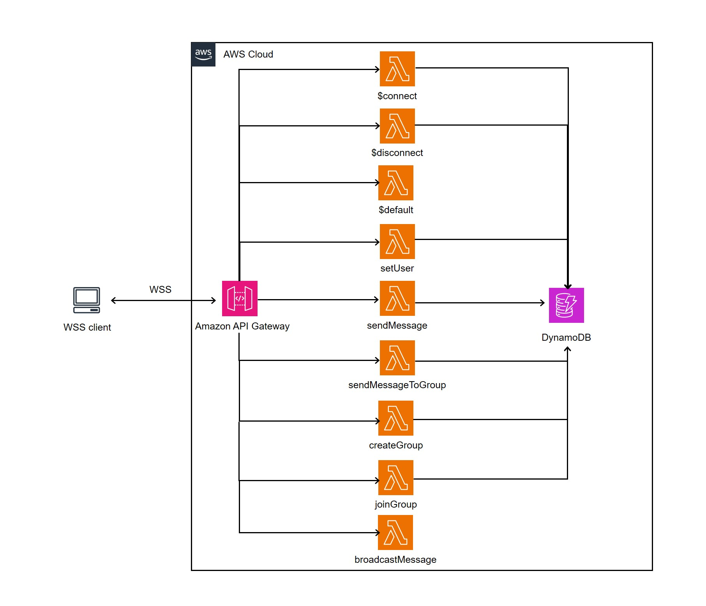

# AWS Websocket API Chat



In order to deploy the example, you need to run the following command:

```
$ serverless deploy
```

After running deploy, you should see output similar to:

```bash
Deploying sls-chat-v2 to stage dev (us-east-1)

✔ Service deployed to stack sls-chat-v2-dev (112s)
```
